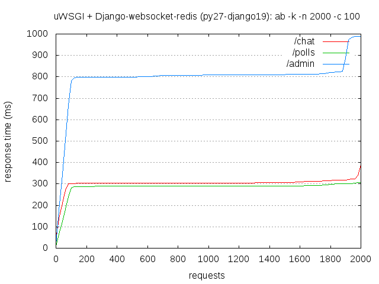
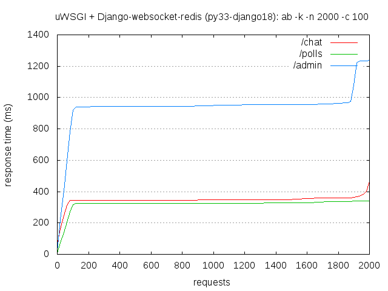
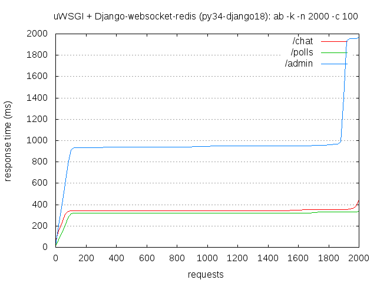
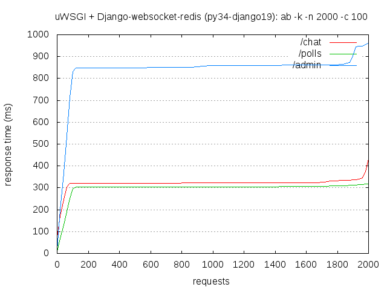
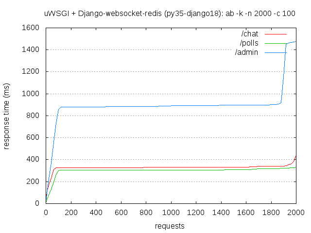
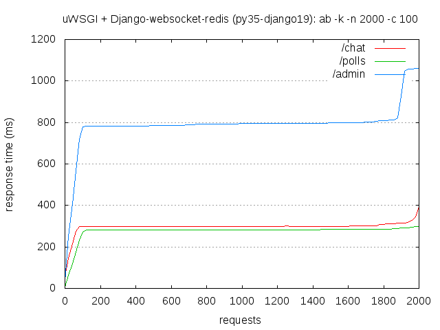

.. _Tornado: https://github.com/tornadoweb/tornado
.. _tornado_main.py: https://github.com/bdarnell/django-tornado-demo/blob/master/testsite/tornado_main.py

Tests for Tornado_
==================

- GitHub repo: https://github.com/tornadoweb/tornado
- ReadTheDoc: http://www.tornadoweb.org/en/stable

.. contents::
    :depth: 2
    :backlinks: none

Summary
-------
Compatibility with Python and Django
````````````````````````````````````
Numquam honeste facimus causa facimus ab non honestissime se insectarique sit detrahunt nostra causa quibus.

============  ==========  ================  ================  =============  =================
Python        Django      More details      Websocket works?  Django works?  So, does it work?
============  ==========  ================  ================  =============  =================
Python 2.7    Django 1.8  `py27-django18`_   ✓ Yes            ✓ Yes          **✓ Yes**
Python 2.7    Django 1.9  `py27-django19`_   ✓ Yes            ✓ Yes          **✓ Yes**
Python 3.2    Django 1.8  `py32-django18`_   ─ Maybe yes      ─ Maybe yes    **─ Maybe yes**
Python 3.3    Django 1.8  `py33-django18`_   ✓ Yes            ✓ Yes          **✓ Yes**
Python 3.4    Django 1.8  `py34-django18`_   ✓ Yes            ✓ Yes          **✓ Yes**
Python 3.4    Django 1.9  `py34-django19`_   ✓ Yes            ✓ Yes          **✓ Yes**
Python 3.5    Django 1.8  `py35-django18`_   ✓ Yes            ✓ Yes          **✓ Yes**
Python 3.5    Django 1.9  `py35-django19`_   ✓ Yes            ✓ Yes          **✓ Yes**
============  ==========  ================  ================  =============  =================

Easy to install?
````````````````
Easy.

Read more at `Installation`_.

Integration into a Django project
`````````````````````````````````
Easy, we just need to wrap Django into a Tornado `WSGIContainer`, make a route for it and it works fine.

Read more at `Integration`_.

Thin or heavy architecture?
```````````````````````````
Both, Tornado_ can be a web framework and an HTTP server at the same time.

Read more at `Architecture`_.

Event-driven programming?
`````````````````````````
No, but I can make it like event-driven I guess.

Read more at `Event-driven programming`_.

Has a documentation?
````````````````````
Yes.

Read more at `Documentation`_.

Has unit tests?
```````````````
Yes.

Read more at `Unit tests`_.

----------------------------------------------------------------------------------------------------------------------

Installation
------------
You can read the `official documentation <http://www.tornadoweb.org/en/stable/index.html#installation>`_ too.

.. code-block:: bash

    $ mkvirtualenv --python=/usr/bin/pythonX.X dtws-tornado
    # You are now in your new virtual environment
    $ pip install tornado Django tox
    $ django-admin startproject DjangoTestWebsockets
    $ django-admin startapp myapp

Integration
-----------
To use *Django* with *Tornado*, you can download and modify the file tornado_main.py_ (thanks to Ben Darnell)
depending on your use.

The most important parts of this file are:

- We have two routes: ``/hello-tornado`` and ``.*``,
- We have two handlers: ``HelloHandler`` (for *Tornado*) and ``django.core.handlers.wsgi.WSGIHandler`` (for *Django*),
-  Our two routes are respectively binded to our two handlers:

   - When a client make a request for ``^/hello-tornado$``, ``HelloHandler`` will pick up the burden,
   - Otherwise, as long as ``^.*$`` matches all requests, it's used as a fallback for all other requests that will be passed to *Django*.

To run the server, run:

.. code-block:: bash

    $ # Always in your virtual environment at your project root
    $ PYTHONPATH=. DJANGO_SETTINGS_MODULE=DjangoTestWebsockets.settings DjangoTestWebsockets/tornado_main.py

Also, I will use my own `django polls app <https://github.com/Kocal/django-polls>`_ to see if Django works fine.

Compatibility
-------------
Test compatibility with different version of Python and Django
``````````````````````````````````````````````````````````````
To list available tests, you can run:

.. code-block:: bash

    $ tox -l

To run a specific test, run for example:

.. code-block:: bash

    $ tox -e py27-django19

py27-django18
`````````````
Tornado.websocket
.................
The communication between the client and the server works fine::

    [I 160426 08:11:21 web:1932] 304 GET /hello-tornado (127.0.0.1) 0.62ms
    WebSocket opened
    Someone said: Hello, world
    Someone said: Test for Python 2.7 and Django 1.8
    WebSocket closed

Django
......
My polls app works fine::

    [I 160426 08:12:33 wsgi:355] 200 GET /polls/ (127.0.0.1) 210.89ms
    [I 160426 08:12:35 wsgi:355] 200 GET /polls/4/ (127.0.0.1) 40.09ms
    [I 160426 08:12:37 wsgi:355] 302 POST /polls/4/vote/ (127.0.0.1) 119.37ms
    [I 160426 08:12:38 wsgi:355] 200 GET /polls/4/results/ (127.0.0.1) 21.54ms
    [I 160426 08:12:41 wsgi:355] 200 GET /polls/ (127.0.0.1) 16.15ms

Benchmark
.........
.. image:: benchmarks/py27-django18/benchmark.png

py27-django19
`````````````
Tornado.websocket
.................
The communication between the client and the server works fine::

    [I 160426 08:21:14 web:1946] 304 GET /hello-tornado (127.0.0.1) 0.63ms
    WebSocket opened
    Someone said: Hello, world
    Someone said: Test for Python 2.7 and Django 1.9
    WebSocket closed

Django
......
My polls app works fine::

    [I 160426 08:18:29 wsgi:355] 200 GET /polls/ (127.0.0.1) 45.67ms
    [I 160426 08:18:29 web:1946] 304 GET /static/polls/style.css (127.0.0.1) 13.69ms
    [I 160426 08:18:33 wsgi:355] 200 GET /polls/4/ (127.0.0.1) 19.17ms
    [I 160426 08:18:35 wsgi:355] 302 POST /polls/4/vote/ (127.0.0.1) 121.51ms
    [I 160426 08:18:35 wsgi:355] 200 GET /polls/4/results/ (127.0.0.1) 18.62ms
    [I 160426 08:18:37 wsgi:355] 200 GET /polls/4/ (127.0.0.1) 16.57ms
    [I 160426 08:18:38 wsgi:355] 200 GET /polls/ (127.0.0.1) 13.90ms

Benchmark
.........


py32-django18
`````````````
Does not work because Pip is broken with Python 3.2, but otherwise I'm sure it can works.

py33-django18
`````````````
Tornado.websocket
.................
The communication between the client and the server works fine::

    Tornado server started on port 8080
    [I 160426 08:56:22 web:1946] 304 GET /hello-tornado (127.0.0.1) 1.73ms
    WebSocket opened
    Someone said: Hello, world
    Someone said: Hello for py 33 django 18
    WebSocket closed

Django
......
My polls app works fine::

    [I 160426 08:58:09 wsgi:355] 200 GET /polls/ (127.0.0.1) 244.26ms
    [I 160426 08:58:10 web:1946] 304 GET /static/polls/style.css (127.0.0.1) 25.54ms
    [I 160426 08:58:10 web:1946] 304 GET /static/polls/images/background.jpg (127.0.0.1) 2.47ms
    [I 160426 08:58:12 wsgi:355] 200 GET /polls/4/ (127.0.0.1) 51.47ms
    [I 160426 08:58:14 wsgi:355] 302 POST /polls/4/vote/ (127.0.0.1) 151.73ms
    [I 160426 08:58:15 wsgi:355] 200 GET /polls/4/results/ (127.0.0.1) 33.81ms

Benchmark
.........


py34-django18
`````````````
Tornado.websocket
.................
The communication between the client and the server works fine::

    WebSocket opened
    Someone said: Hello, world
    Someone said: Hello for py 34 django 18
    WebSocket closed

Django
......
My polls app works fine::

    Tornado server started on port 8080
    [I 160426 09:00:28 wsgi:355] 200 GET /polls/4/ (127.0.0.1) 78.70ms
    [I 160426 09:00:32 wsgi:355] 200 GET /polls/ (127.0.0.1) 13.07ms
    [I 160426 09:00:33 wsgi:355] 200 GET /polls/4/ (127.0.0.1) 16.65ms
    [I 160426 09:00:35 wsgi:355] 302 POST /polls/4/vote/ (127.0.0.1) 138.02ms
    [I 160426 09:00:35 wsgi:355] 200 GET /polls/4/results/ (127.0.0.1) 43.93ms

Benchmark
.........


py34-django19
`````````````
Tornado.websocket
.................
The communication between the client and the server works fine::

    [I 160426 09:22:22 web:1946] 304 GET /hello-tornado (127.0.0.1) 0.76ms
    WebSocket opened
    Someone said: Hello, world
    Someone said: Hello for py 34 django 19
    WebSocket closed

Django
......
My polls app works fine::

    Tornado server started on port 8080
    [I 160426 09:21:55 wsgi:355] 200 GET /polls/ (127.0.0.1) 396.51ms
    [I 160426 09:21:55 web:1946] 304 GET /static/polls/style.css (127.0.0.1) 8.13ms
    [I 160426 09:21:59 wsgi:355] 200 GET /polls/4/ (127.0.0.1) 68.36ms
    [I 160426 09:22:01 wsgi:355] 302 POST /polls/4/vote/ (127.0.0.1) 147.77ms
    [I 160426 09:22:01 wsgi:355] 200 GET /polls/4/results/ (127.0.0.1) 19.95ms

Benchmark
.........


py35-django18
`````````````
Tornado.websocket
.................
It works::

    WebSocket opened
    Someone said: Hello, world
    Someone said: Hello for py 35 django 18
    WebSocket closed

Django
......
It works::

    Tornado server started on port 8080
    [I 160426 09:24:19 wsgi:355] 200 GET /polls/ (127.0.0.1) 85.62ms
    [I 160426 09:24:21 wsgi:355] 200 GET /polls/4/ (127.0.0.1) 24.46ms
    [I 160426 09:24:23 wsgi:355] 302 POST /polls/4/vote/ (127.0.0.1) 172.08ms
    [I 160426 09:24:23 wsgi:355] 200 GET /polls/4/results/ (127.0.0.1) 28.34ms
    [I 160426 09:24:24 wsgi:355] 200 GET /polls/ (127.0.0.1) 23.20ms

Benchmark
.........


py35-django19
`````````````
Tornado.websocket
.................
It works::

    WebSocket opened
    Someone said: Hello, world
    Someone said: Hello for py 35 django 19
    WebSocket closed

Django
......
It works::

    Tornado server started on port 8080
    [I 160426 09:29:21 wsgi:355] 200 GET /polls/ (127.0.0.1) 53.86ms
    [I 160426 09:29:22 wsgi:355] 200 GET /polls/4/ (127.0.0.1) 18.21ms
    [I 160426 09:29:24 wsgi:355] 302 POST /polls/4/vote/ (127.0.0.1) 134.89ms
    [I 160426 09:29:24 wsgi:355] 200 GET /polls/4/results/ (127.0.0.1) 17.95ms
    [I 160426 09:29:24 wsgi:355] 200 GET /polls/ (127.0.0.1) 28.57ms

Benchmark
.........


Architecture
------------
To use Tornado websockets with Django, you should run a Tornado server which wraps:

- A websocket handler (search for ``myapp.hellowebsocket.HelloWebSocket``)
- *Django*'s *WSGIHandler* into a *Tornado*'s *WSGIContainer*

Tornado is an alternative to `WSGI <https://www.python.org/dev/peps/pep-3333/>`_, so Python webservers like *Gunicorn*,
*uWSGI*, ... can not be used.

Event-driven programming
------------------------
No, but I already wrote something about this for `django-websocket-redis <https://github.com/Kocal/django-test-websocket
s/tree/django-websocket-redis#event-driven-programming-1>`_, to see how I can implement an even-driver programming way
for both server and client side.

Documentation
-------------
Yes, a nice written one: `this address <http://www.tornadoweb.org/en/stable/guide.html>`__.

Unit tests
----------
Yes, at `this address <https://github.com/tornadoweb/tornado/tree/master/tornado/test>`__.
