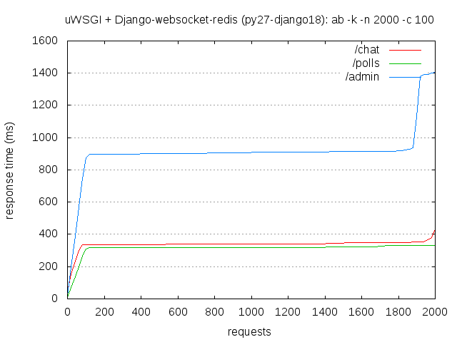

.. _django-socketio: https://github.com/stephenmcd/django-socketio
.. _gevent-socketio: https://github.com/abourget/gevent-socketio
.. _tox.ini: tox.ini
.. _settings.py: DjangoTestWebsockets/settings.py
.. _urls.py: DjangoTestWebsockets/urls.py
.. _index.html: myapp/templates/myapp/index.html

Tests for django-socketio_
==========================

.. contents::
    :depth: 2
    :backlinks: none

Summary
-------
Compatibility with Python and Django
````````````````````````````````````
django-socketio_ **(version 0.3.9) do not works**, however the Python version or Django version.

============  ==========  ================  ====================  ========================  =============
Python        Django      More details      Django server works?  Websockets server works?  Does it work?
============  ==========  ================  ====================  ========================  =============
Python 2.7    Django 1.8  `py27-django18`_  ✓ Yes                 ✗ No                      ✗ **No**
Python 2.7    Django 1.9  `py27-django19`_  ✗ No                  ✗ No                      ✗ **No**
Python 3.2    Django 1.8  `py32-django18`_  ✗ No                  ✗ No                      ✗ **No**
Python 3.3    Django 1.8  `py33-django18`_  ✗ No                  ✗ No                      ✗ **No**
Python 3.4    Django 1.8  `py34-django18`_  ✗ No                  ✗ No                      ✗ **No**
Python 3.4    Django 1.9  `py34-django19`_  ✗ No                  ✗ No                      ✗ **No**
Python 3.5    Django 1.8  `py35-django18`_  ✗ No                  ✗ No                      ✗ **No**
Python 3.5    Django 1.9  `py35-django19`_  ✗ No                  ✗ No                      ✗ **No**
============  ==========  ================  ====================  ========================  =============

Easy to install?
````````````````
Looks easy to install, but in fact it do not works. :-)

Read more at `Installation`_.

Integration into a Django project
`````````````````````````````````
Easy, but I said django-socketio_ do not works.

Read more at `Integration`_.


Thin or heavy architecture?
```````````````````````````
Who cares? It do not works. (but it's thin!)

Read more at `Architecture`_.

Event-driven programming?
`````````````````````````
Yes, good point, but still do not works!

Read more at `Event-driven programming`_.

Has a documentation?
````````````````````
Yes, a nice written one.

Read more at `Documentation`_.

Has unit tests?
```````````````
Yes, about 6 assertions.

Read more at `Unit tests`_.

----------------------------------------------------------------------------------------------------------------------

Installation
------------
As said before, django-socketio_ only works with version 2.7 of Python.

.. code-block:: bash

    $ mkvirtualenv --python=/usr/bin/python2.7 dtws-django-socketio
    # You are now in your new virtual environment
    $ pip install django-socketio==0.3.9 tox


Integration
-----------
Add `django_socketio` to your `INSTALLED_APPS` in your settings.py_ file:

.. code-block:: python

    INSTALLED_APPS = [
        # ...
        'django_socketio',
    ]

Add `django_socketio.urls` to your urls.py_ file:

.. code-block:: python

    urlpatterns = [
        url('', include('django_socketio.urls')),
        # ...
    ]

Integration into a template:

.. code-block:: html+django

    

    <script src=""></script>
    <script>
        var socket = new io.Socket('localhost', {port: 9000})
        socket.connect()
    </script>

Compatibility
-------------
As said before, django-socketio_ does not work. So there is no need to run Django server, SocketIO server, or any tests.

Running SocketIO server
```````````````````````
If you are really a disgusting masochist, you can run SocketIO server with:

.. code-block:: bash

    $ workon dtws-django-socketio
    $ python manage.py runserver_socketio

Then, ``SocketIOServer running on 127.0.0.1:9000`` will appears on your screen.

If you try to connect to the SocketIO server in your browser, you will get an error about the handshake:

.. code-block::

    File "/home/hugo/Dev/DjangoTestWebsockets/.tox/py27-django18/local/lib/python2.7/site-packages/socketio/transports.py", line 19, in write_packed
      self.write(data)
    File "/home/hugo/Dev/DjangoTestWebsockets/.tox/py27-django18/local/lib/python2.7/site-packages/socketio/transports.py", line 22, in write
      if 'Content-Length' not in self.handler.response_headers_list:

    AttributeError: 'SocketIOHandler' object has no attribute 'response_headers_list'
    <Greenlet at 0xb66c57fcL: _handle_and_close_when_done(<bound method SocketIOServer.handle of <SocketIOSe, <bound method SocketIOServer.do_close of <SocketIO, (<socket at 0xb54de7acL fileno=[Errno 9] Bad file )> failed with AttributeError

I found a thread [#]_ about this error, where I tried a *working solution* [#]_:

.. code-block:: bash

    $ pip uninstall gevent-socketio gevent
    $ pip install gevent-socketio==0.2.1 gevent==0.13.6

.. [#] https://github.com/stephenmcd/django-socketio/issues/63
.. [#] https://github.com/stephenmcd/django-socketio/issues/63#issuecomment-136751471

Then re-run the SocketIO server, and immediately after, you will get an other error:

.. code-block::

    File "/home/hugo/Dev/DjangoTestWebsockets/.tox/py27-django18/local/lib/python2.7/site-packages/gevent/socket.py", line 784, in <module>
      from gevent.ssl import sslwrap_simple as ssl, SSLError as sslerror, SSLSocket as SSLType
    File "/home/hugo/Dev/DjangoTestWebsockets/.tox/py27-django18/local/lib/python2.7/site-packages/gevent/ssl.py", line 422, in <module>
      def get_server_certificate(addr, ssl_version=PROTOCOL_SSLv3, ca_certs=None):

    NameError: name 'PROTOCOL_SSLv3' is not defined

I found again a thread [#]_ about this error, and I was due to my Python version (2.7 on Debian) that was compiled with
``OPENSSL_NO_SSLv3`` flag [#]_.

.. [#] https://github.com/docker-library/python/issues/29
.. [#] https://github.com/docker-library/python/issues/29#issuecomment-69251731

Test compatibility with different version of Python and Django
``````````````````````````````````````````````````````````````
To list available tests, you can run:

.. code-block:: bash

    $ tox -l

To run a specific test, run for example:

.. code-block:: bash

    $ tox -e py27-django18

py27-django18
`````````````
Django server works?
....................

    ✓ Passed

Yes::

    py27-django18 runtests: commands[6] | uwsgi --ini uwsgi.ini
    [uWSGI] getting INI configuration from uwsgi.ini
    *** Starting uWSGI 2.0.12 (32bit) on [Wed Apr 27 15:25:51 2016] ***
    compiled with version: 4.9.2 on 27 April 2016 09:31:58
    os: Linux-3.16.0-4-686-pae #1 SMP Debian 3.16.7-ckt25-2 (2016-04-08)
    nodename: stagiaire
    machine: i686
    clock source: unix
    pcre jit disabled
    detected number of CPU cores: 2
    current working directory: /home/hugo/Dev/DjangoTestWebsockets
    writing pidfile to /tmp/project-master.pid
    detected binary path: /home/hugo/Dev/DjangoTestWebsockets/.tox/py27-django18/bin/uwsgi
    chdir() to /home/hugo/Dev/DjangoTestWebsockets
    your processes number limit is 15561
    your memory page size is 4096 bytes
    detected max file descriptor number: 65536
    - async cores set to 200 - fd table size: 65536
    lock engine: pthread robust mutexes
    thunder lock: disabled (you can enable it with --thunder-lock)
    uwsgi socket 0 bound to TCP address 127.0.0.1:8000 fd 3
    Python version: 2.7.9 (default, Mar  1 2015, 18:26:48)  [GCC 4.9.2]
    Python main interpreter initialized at 0x8c484c8
    python threads support enabled
    your server socket listen backlog is limited to 100 connections
    your mercy for graceful operations on workers is 60 seconds
    mapped 3077952 bytes (3005 KB) for 200 cores
    *** Operational MODE: async ***
    WSGI app 0 (mountpoint='') ready in 2 seconds on interpreter 0x8c484c8 pid: 27680 (default app)
    *** uWSGI is running in multiple interpreter mode ***
    spawned uWSGI master process (pid: 27680)
    spawned uWSGI worker 1 (pid: 27683, cores: 200)
    *** running gevent loop engine [addr:0x80d42a0] ***

Websockets server works?
........................

    ✗ Failed

It boots fine even if there is an error. It's because I'm not running the websocket server with root access (port 843 is lower than 1024 ;-)) ::

    (py27-django18) ❯ python manage.py runserver_socketio

    SocketIOServer running on 127.0.0.1:9000

    FAILED to start flash policy server: [Errno 13] Permission denied: ('0.0.0.0', 843)

But when a client wants to connect to the web socket server, it fails during the handshake::

    Traceback (most recent call last):
      File "/home/hugo/Dev/DjangoTestWebsockets/.tox/py27-django18/local/lib/python2.7/site-packages/gevent/greenlet.py", line 534, in run
        result = self._run(*self.args, **self.kwargs)
      File "/home/hugo/Dev/DjangoTestWebsockets/.tox/py27-django18/local/lib/python2.7/site-packages/gevent/baseserver.py", line 25, in _handle_and_close_when_done
        return handle(*args_tuple)
      File "/home/hugo/Dev/DjangoTestWebsockets/.tox/py27-django18/local/lib/python2.7/site-packages/socketio/server.py", line 49, in handle
        handler.handle()
      File "/home/hugo/Dev/DjangoTestWebsockets/.tox/py27-django18/local/lib/python2.7/site-packages/gevent/pywsgi.py", line 443, in handle
        result = self.handle_one_request()
      File "/home/hugo/Dev/DjangoTestWebsockets/.tox/py27-django18/local/lib/python2.7/site-packages/gevent/pywsgi.py", line 658, in handle_one_request
        self.handle_one_response()
      File "/home/hugo/Dev/DjangoTestWebsockets/.tox/py27-django18/local/lib/python2.7/site-packages/socketio/handler.py", line 58, in handle_one_response
        self.handle_one_response(call_wsgi_app=False)
    TypeError: handle_one_response() got an unexpected keyword argument 'call_wsgi_app'
    <Greenlet at 0xb5ef8accL: _handle_and_close_when_done(<bound method SocketIOServer.handle of <SocketIOSe, <bound method SocketIOServer.do_close of <SocketIO, (<socket at 0xb5ed07acL fileno=[Errno 9] Bad file )> failed with TypeError

    Traceback (most recent call last):
      File "/home/hugo/Dev/DjangoTestWebsockets/.tox/py27-django18/local/lib/python2.7/site-packages/gevent/greenlet.py", line 534, in run
        result = self._run(*self.args, **self.kwargs)
      File "/home/hugo/Dev/DjangoTestWebsockets/.tox/py27-django18/local/lib/python2.7/site-packages/gevent/baseserver.py", line 25, in _handle_and_close_when_done
        return handle(*args_tuple)
      File "/home/hugo/Dev/DjangoTestWebsockets/.tox/py27-django18/local/lib/python2.7/site-packages/socketio/server.py", line 49, in handle
        handler.handle()
      File "/home/hugo/Dev/DjangoTestWebsockets/.tox/py27-django18/local/lib/python2.7/site-packages/gevent/pywsgi.py", line 443, in handle
        result = self.handle_one_request()
      File "/home/hugo/Dev/DjangoTestWebsockets/.tox/py27-django18/local/lib/python2.7/site-packages/gevent/pywsgi.py", line 658, in handle_one_request
        self.handle_one_response()
      File "/home/hugo/Dev/DjangoTestWebsockets/.tox/py27-django18/local/lib/python2.7/site-packages/socketio/handler.py", line 68, in handle_one_response
        jobs = self.transport.connect(session, request_method)
      File "/home/hugo/Dev/DjangoTestWebsockets/.tox/py27-django18/local/lib/python2.7/site-packages/socketio/transports.py", line 92, in connect
        self.write_packed(session_id)
      File "/home/hugo/Dev/DjangoTestWebsockets/.tox/py27-django18/local/lib/python2.7/site-packages/socketio/transports.py", line 19, in write_packed
        self.write(data)
      File "/home/hugo/Dev/DjangoTestWebsockets/.tox/py27-django18/local/lib/python2.7/site-packages/socketio/transports.py", line 22, in write
        if 'Content-Length' not in self.handler.response_headers_list:
    AttributeError: 'SocketIOHandler' object has no attribute 'response_headers_list'
    <Greenlet at 0xb5ef8accL: _handle_and_close_when_done(<bound method SocketIOServer.handle of <SocketIOSe, <bound method SocketIOServer.do_close of <SocketIO, (<socket at 0xb5ed096cL fileno=[Errno 9] Bad file )> failed with AttributeError


Benchmark
.........



py27-django19
`````````````
Django server works?
....................

    ✗ Failed

No, because django-socketio_ was not made for *Django 1.9* nad it fails because of an ``ImportError``::

    py27-django19 runtests: commands[3] | python manage.py migrate
    Traceback (most recent call last):
      File "manage.py", line 10, in <module>
        execute_from_command_line(sys.argv)
      File "/home/hugo/Dev/DjangoTestWebsockets/.tox/py27-django19/local/lib/python2.7/site-packages/django/core/management/__init__.py", line 353, in execute_from_command_line
        utility.execute()
      File "/home/hugo/Dev/DjangoTestWebsockets/.tox/py27-django19/local/lib/python2.7/site-packages/django/core/management/__init__.py", line 345, in execute
        self.fetch_command(subcommand).run_from_argv(self.argv)
      File "/home/hugo/Dev/DjangoTestWebsockets/.tox/py27-django19/local/lib/python2.7/site-packages/django/core/management/base.py", line 348, in run_from_argv
        self.execute(*args, **cmd_options)
      File "/home/hugo/Dev/DjangoTestWebsockets/.tox/py27-django19/local/lib/python2.7/site-packages/django/core/management/base.py", line 398, in execute
        self.check()
      File "/home/hugo/Dev/DjangoTestWebsockets/.tox/py27-django19/local/lib/python2.7/site-packages/django/core/management/base.py", line 426, in check
        include_deployment_checks=include_deployment_checks,
      File "/home/hugo/Dev/DjangoTestWebsockets/.tox/py27-django19/local/lib/python2.7/site-packages/django/core/checks/registry.py", line 75, in run_checks
        new_errors = check(app_configs=app_configs)
      File "/home/hugo/Dev/DjangoTestWebsockets/.tox/py27-django19/local/lib/python2.7/site-packages/django/core/checks/urls.py", line 13, in check_url_config
        return check_resolver(resolver)
      File "/home/hugo/Dev/DjangoTestWebsockets/.tox/py27-django19/local/lib/python2.7/site-packages/django/core/checks/urls.py", line 23, in check_resolver
        for pattern in resolver.url_patterns:
      File "/home/hugo/Dev/DjangoTestWebsockets/.tox/py27-django19/local/lib/python2.7/site-packages/django/utils/functional.py", line 33, in __get__
        res = instance.__dict__[self.name] = self.func(instance)
      File "/home/hugo/Dev/DjangoTestWebsockets/.tox/py27-django19/local/lib/python2.7/site-packages/django/core/urlresolvers.py", line 417, in url_patterns
        patterns = getattr(self.urlconf_module, "urlpatterns", self.urlconf_module)
      File "/home/hugo/Dev/DjangoTestWebsockets/.tox/py27-django19/local/lib/python2.7/site-packages/django/utils/functional.py", line 33, in __get__
        res = instance.__dict__[self.name] = self.func(instance)
      File "/home/hugo/Dev/DjangoTestWebsockets/.tox/py27-django19/local/lib/python2.7/site-packages/django/core/urlresolvers.py", line 410, in urlconf_module
        return import_module(self.urlconf_name)
      File "/usr/lib/python2.7/importlib/__init__.py", line 37, in import_module
        __import__(name)
      File "/home/hugo/Dev/DjangoTestWebsockets/DjangoTestWebsockets/urls.py", line 22, in <module>
        url('', include('django_socketio.urls')),
      File "/home/hugo/Dev/DjangoTestWebsockets/.tox/py27-django19/local/lib/python2.7/site-packages/django/conf/urls/__init__.py", line 52, in include
        urlconf_module = import_module(urlconf_module)
      File "/usr/lib/python2.7/importlib/__init__.py", line 37, in import_module
        __import__(name)
      File "/home/hugo/Dev/DjangoTestWebsockets/.tox/py27-django19/local/lib/python2.7/site-packages/django_socketio/urls.py", line 4, in <module>
        from django.utils.importlib import import_module
    ImportError: No module named importlib

Websockets server works?
........................

    ✗ Failed

Neither, because we run this server with ``python manage.py runserver_socketio`` which use *Django* and *Django* does not
work.

py32-django18
`````````````

    ✗ Failed

No, *pip* is broken **lel**.

py33-django18
`````````````
Django server works?
....................

    ✗ Failed

No, because django-socketio_ does not work with *Python >= 3*, it fails during installation process::

    Collecting django-socketio
      Using cached django-socketio-0.3.9.tar.gz
        Complete output from command python setup.py egg_info:
        Traceback (most recent call last):
          File "<string>", line 1, in <module>
          File "/tmp/pip-build-745awm/django-socketio/setup.py", line 7, in <module>
            version = __import__("django_socketio").__version__,
          File "/tmp/pip-build-745awm/django-socketio/django_socketio/__init__.py", line 2, in <module>
            from django_socketio.utils import NoSocket, send, broadcast, broadcast_channel
          File "/tmp/pip-build-745awm/django-socketio/django_socketio/utils.py", line 44
            except IndexError, KeyError:
                             ^
        SyntaxError: invalid syntax

        ----------------------------------------
    Command "python setup.py egg_info" failed with error code 1 in /tmp/pip-build-745awm/django-socketio/

    ERROR: could not install deps [uwsgi, django-socketio, django >=1.8,<1.9]; v = InvocationError('/home/hugo/Dev/DjangoTestWebsockets/.tox/py33-django18/bin/pip install uwsgi django-socketio django >=1.8,<1.9 (see /home/hugo/Dev/DjangoTestWebsockets/.tox/py33-django18/log/py33-django18-1.log)', 1)

Websockets server works?
........................

    ✗ Failed

I told you *Tox* can not install django-socketio_.

py34-django18
`````````````

    ✗ Failed

See `py33-django18`_.

py34-django19
`````````````

    ✗ Failed

See `py33-django18`_.

py35-django18
`````````````

    ✗ Failed

See `py33-django18`_.

py35-django19
`````````````

    ✗ Failed

See `py33-django18`_.

Architecture
------------
Thin architecture, django-socketio_ only uses gevent-socketio_ to work.

Event-driven programming
------------------------
Yes, django-socketio_ try to use a SocketIO approach to handle websockets events.

Here a really small example for a webchat:

.. code-block:: python

    from django_socket import events

    @events.on_connect
    def connect(request, socket, context):
        print("We got a new user on the chat")
        # ...

    @events.on_finish
    def finish(request, socket, context):
        print("An user just leave the chat")
        # ...


You can see more on the `official demo <https://github.com/stephenmcd/django-socketio/blob/master/django_socketio/example_project/chat/events.py>`_.

Documentation
-------------
Yes, the documentation is written into the `README file <https://github.com/stephenmcd/django-socketio#readme>`_
of django-socketio_ repo.

Unit tests
----------
Yes, django-socketio_ has some tests. You can see these in `this file <https://github.com/stephenmcd/django-socketio/blob/master/django_socketio/tests.py>`_.
